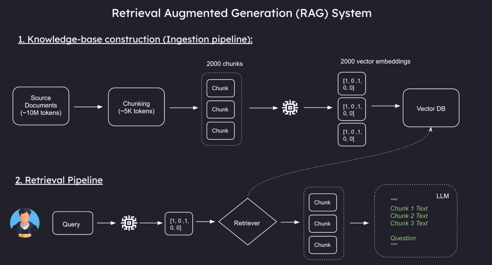
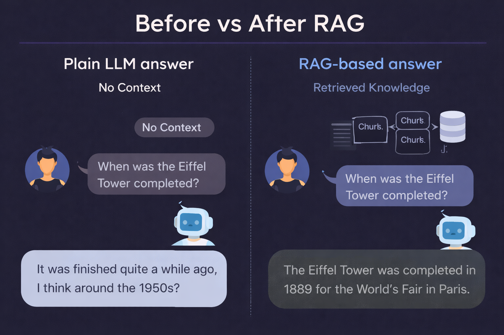

# Retrieval-Augmented Generation (RAG)

## 📌 Overview
This repository implements a clear, end-to-end **Retrieval-Augmented Generation (RAG)** system. RAG enhances Large Language Models (LLMs) by grounding their responses in external, reliable knowledge sources rather than relying only on their pre-trained memory.

The main goal of this project is to demonstrate how document retrieval, embeddings, and vector databases work together to produce more accurate, context-aware, and less hallucination-prone AI responses.

---
## 🔹 Concepts Explained (From the Main Diagram)

### 1) User Query
The process starts when a user asks a question. Instead of sending this directly to an LLM, the system first looks for relevant information from external documents.

### 2) Document Knowledge Base
Your system maintains a collection of documents (PDFs, reports, articles, or text files). These act as the factual source of information for the AI.

### 3) Chunking
Large documents cannot be processed in one piece because LLMs have token limits. Therefore, documents are split into smaller, meaningful chunks that can be individually embedded and retrieved.

### 4) Tokens (How LLMs Read Text)
Before generating embeddings, text is internally broken into **tokens**. A token may be a word, part of a word, or even a single character. This is why very long documents must be divided into chunks.

### 5) Embeddings (Meaning as Numbers)
Each text chunk is converted into a numerical vector called an **embedding**. These vectors capture the *semantic meaning* of the text rather than just the exact words.

Conceptually:
- Similar ideas produce similar vectors.
- Dissimilar ideas produce distant vectors.
- This allows computers to compare meaning mathematically.

### 6) Vector Database
All embeddings are stored in a **vector database**, which is optimized for similarity search rather than keyword search. When a new query arrives, this database helps quickly find the most relevant document chunks.

Common examples include: FAISS, Chroma, Pinecone, Weaviate, and Milvus.

### 7) Retrieval (Similarity Search)
When a user asks a question:
1. The query is converted into an embedding.
2. The vector database searches for the most similar document embeddings.
3. The most relevant chunks are retrieved as context.

### 8) Consistency Rule for Embeddings
It is essential to use **the same embedding model** for both:
- Storing documents
- Processing user queries

If the embedding model changes, all stored documents must be re-embedded.

### 9) Augmented Prompt
The retrieved document chunks are combined with the user’s question to form an **augmented prompt**. This gives the LLM both the question and reliable context.

### 10) Final LLM Response
The LLM generates a response based on:
- The user’s original question
- The retrieved factual context

This results in answers that are more accurate, traceable, and aligned with real documents.

---
## 🔄 Complete RAG Workflow (Clean Step-by-Step)
1. Ingest documents into the system
2. Split documents into chunks
3. Generate embeddings for each chunk
4. Store embeddings in a vector database
5. User submits a query
6. Convert query into an embedding
7. Retrieve similar document chunks
8. Build an augmented prompt
9. Generate final answer using an LLM

---
## 🛠️ Suggested Tech Stack
- **LLM:** Groq / OpenAI / Hugging Face
- **Embeddings:** OpenAI Embeddings / Sentence Transformers
- **Vector DB:** FAISS / Chroma / Pinecone
- **Backend:** Python
- **Frontend (Optional):** Streamlit

---

## 🖼️ Additional Images

